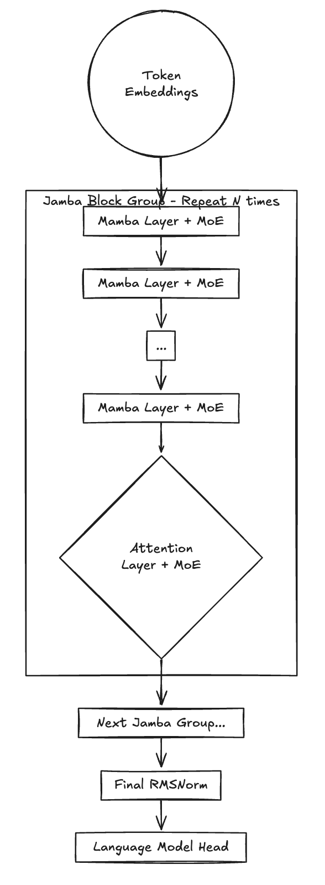
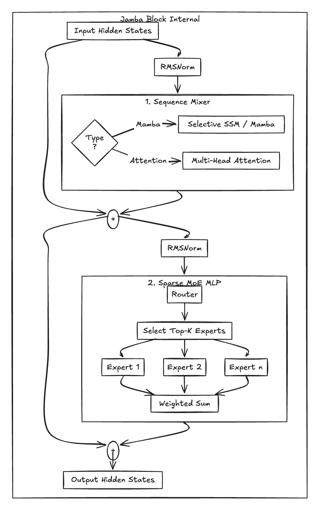

# 混合架构详解：Transformer 与 Mamba 的深度融合 (以 Jamba 为例)

> **摘要**：
> Transformer 架构受限于 $O(L^2)$ 的计算复杂度与随序列长度 $L$ 线性膨胀的 KV Cache。
> **Jamba**（AI21 Labs）通过将 **Mamba (Selective SSM)**、**Transformer** 与 **MoE (Mixture-of-Experts)** 混合，实现了在长文本场景下的性能突破。
> 本章将解构 Jamba 的数学本质，探讨其如何通过“混合机制”在记忆精度与计算效率之间取得平衡。

## 一、数学基石：从通用 SSM 到 Mamba 的进化

Mamba 的核心在于**选择性状态空间模型 (Selective SSM)**。与通用 SSM 不同，Mamba 在实现上为了计算效率进行了关键简化。

### 1. 离散化的工程近似

在连续系统中，$\dot{h}(t) = \mathbf{A}h(t) + \mathbf{B}x(t)$。在 Mamba 的工程实现中，假设 $\mathbf{A}$ 为**对角矩阵**，利用零阶保持 (ZOH) 进行离散化，其简化形式为：

$$
\bar{A}_k = \exp(\Delta_k \cdot A_{kk}), \quad \bar{B}_k = (\Delta_k \cdot B_k)
$$

> **注**：实际代码中常采用 $\bar{B} = \Delta \odot B$ 的近似处理。这种对角化结构是实现 Fast Scan 和 Fused CUDA Kernel 的前提。
> 由于 A 为对角矩阵，其特征值即为对角线元素 Akk，因此 exp⁡(Δk⋅Akk) 可直接按元素计算，避免了矩阵指数的高昂代价——这正是 Mamba 能实现线性复杂度的数学基础。

### 2. Parallel Scan 的复杂度分析

Mamba 摆脱 RNN 串行限制的关键是 **Associative Scan**。

- **总工作复杂度 (Work Complexity)**：$O(L)$，保证了与序列长度的线性扩展。
- **并行深度 (Parallel Depth)**：$O(\log L)$，决定了在 GPU 上并行执行的步数。

---

## 二、架构设计：为什么需要“混合”？

Jamba 并非纯 Mamba，而是通过**交织（Interleaving）** Attention 层与 Mamba 层来结合两者的优势。

### 宏观结构：交织堆叠 (Interleaved Stack)

Jamba 通过重复多个“Jamba Groups”构建，每个 Group 内部包含了 Attention 与 Mamba 的特定比例（如 1:7）。

### **微观结构：单个混合 Block 内部**

**每个 Block 遵循“先序列混合，后专家混合”的原则。**

### 图示深度解析：

* **Sequence Mixer 层**：这是 Jamba 的核心变量。大部分层（7/8）通过 **Mamba** **进行高效的线性序列处理，只有少数层（1/8）使用** **Attention** **来执行全局 K-V 检索，确保模型不会在超长文本中“迷失”。**
* **Sparse MoE MLP 层**：在每个 Block 的后半部分，Jamba 舍弃了传统的稠密 MLP，转而使用 MoE。

  * **Router（路由器）**：根据输入 Token 的特征，动态决定激活哪几个专家。
* **计算效率**：这种设计使得模型虽然拥有 52B 的巨大“知识容量”（总参数），但每个 Token 处理时只经过 12B 的计算路径（激活参数）。
* **残差流 (Residual Stream)**：图中 **+** **符号代表了残差连接。它保证了即使在深层网络中，梯度也能有效回传，并允许各层在原始输入的基础上只学习“增量”信息。**

### 1. 机制对比与互补性

| 机制                  | 擅长 (Pros)                                                | 不擅长 (Cons)                                                                                                                                                                                                                                  |
| --------------------- | ---------------------------------------------------------- | ---------------------------------------------------------------------------------------------------------------------------------------------------------------------------------------------------------------------------------------------- |
| **Attention**   | **精确检索**：能通过“指针”定位历史中任一精确坐标。 | **非压缩性**：计算与存储随 $L$ 平方/线性增长能力受限。                                                                                                                                                                                 |
| **SSM (Mamba)** | **渐进压缩**：高效处理流式信息，推理成本恒定。       | **压缩损失**：状态 $h_t$ 是对历史信息的 **指数衰减加权和** $h_t = \mathbf{\bar{A}}_t \, h_0 \;+\; \sum_{i=1}^{t} \mathbf{\bar{A}}_{\,t-i} \, \mathbf{\bar{B}} \, x_i$，长序列中早期 token 的权重会急剧衰减，导致难以精确回溯。 |

**Jamba 的策略**：使用少量 Attention 层（如 1:7 比例）作为“全局精确索引锚点”，利用大量 Mamba 层进行“高效语义压缩传输”。这种比例是可调的超参数，需在 recall 精度与推理速度间权衡。

### 2. MoE 层定位

**MoE 作为通用效率工具** ：Jamba 在 MLP 阶段使用 MoE，这是**独立于** SSM/Attention 混合之外的**参数效率**策略。它使得模型可以在不显著增加推理计算量（FLOPS）的情况下，扩展模型的总容量和知识存储量，进一步提升了长文本处理的**语义丰富度**。

---

## 三、工程实践：显存开销的真相

在长文本推理中，Jamba 的显存优势来自于对不同状态的分类管理。

### 1. 显存开销公式对比

- **Mamba 层状态显存 (Fixed)**：不随 $L$ 增长，但受 Batch Size ($B$) 和隐状态维度影响。

  $$
  \text{Mem}_{\text{Mamba}} \propto N_{\text{mamba}} \cdot B \cdot d_{\text{model}} \cdot d_{\text{state}}
  $$
- **Attention 层 KV Cache (Dynamic)**：随 $L$ 线性增长。

  $$
  \text{Mem}_{\text{KV}} \propto N_{\text{attn}} \cdot B \cdot L \cdot n_{\text{kv\_heads}} \cdot d_{\text{head}}
  $$

### 2. KV Cache 的革命性缩减

**修正误区**：Jamba 的 Attention 层**依然需要** KV Cache。

Jamba 通常采用 **Grouped Query Attention (GQA)** 而非标准的 Multi-Head Attention (MHA)。GQA 本身就是一种对 KV Cache 优化的手段，它减少了 Key/Value 头的数量，进一步降低了缓存的内存占用，与 Mamba 的高效设计形成了 **双重优化** 。

其优势在于：由于 Attention 层仅占总层数的约 12.5%（1/8），且通常配合 **GQA** 使用，整体 KV Cache 的增长斜率远低于纯 Transformer。这使得 128k 上下文的推理在单卡上成为可能。

> 以 128K token、Batch Size=1、d_model=4096、典型 GQA 配置（num_kv_heads=2–8）为例：
>
> * 纯 Transformer：KV Cache 约需 **800–1500 MB**（视层数、头数、精度而定）。
> * Jamba（1:7 比例 + GQA）：Attention 层仅占 ~12.5%，KV Cache 约 **100–300 MB**（示例值 230 MB 合理）。
>   **示例值依 GQA 头数、精度（bf16/float16）、具体层数略有浮动，实际以 vLLM / mamba-ssm 实测为准。**
>   **结论** ：Jamba 在同等显存下，可支持 Batch Size 提高 6 倍，或上下文长度提升 6 倍左右（单卡 80GB A100/H100 场景）。

---

## 四、性能与瓶颈：Prefill vs. Decode

Jamba 的计算优势在不同阶段表现不同：

1. **Prefill (预填充)**：Mamba 部分为 $O(L)$，Attention 层采用**全局自注意力**（无滑动窗口、无稀疏注意力），理论上仍为 $O(L^2)$。但由于 Attention 层仅占总层数的约 1/8（典型 1:7 比例），Prefill 阶段的 $O(L^2)$ 部分被极大稀释。实际测试中，128K–256K 上下文的 Prefill 吞吐仍远高于同规模纯 Transformer（官方称 3x+ throughput vs Mixtral 8x7B）。
   1. 这种设计使得  **Prefill 的计算瓶颈从传统的 Attention 平方项，转移到了线性复杂度的 Mamba 部分** ，从而在超长上下文场景下实现了质的飞跃。
2. **Decode (生成)**：Mamba 表现为 $O(1)$ 的状态递推，推理吞吐量极高。
   整体上，混合架构让 Jamba 在长上下文下的端到端吞吐显著领先传统 Transformer。

---

## 五、挑战与局限性 (Limitation)

尽管 Jamba 表现优异，但在工程落地中仍面临挑战：

1. **训练稳定性**：Mamba 与 Attention 的梯度尺度差异显著，通常需要**分层学习率 (Layer-wise Learning Rate)** 以及特殊的初始化（如 HiPPO）和 RMSNorm 策略来防止 Divergence。
2. **生态成熟度**：

   - Transformer 拥有 vLLM, TensorRT-LLM 等完美支持。
   - Mamba/Jamba 依赖专用 **Fused Kernel**，在非 NVIDIA 硬件或旧版本框架上的迁移成本较高。
3. **任务差异**：在极高精度的 In-context Learning 或复杂逻辑推理任务中，纯 Transformer 方案目前仍保留微弱的性能上限优势。
4. **实操技巧** ：训练 Jamba 时，推荐采用 **Layer-wise Adaptive Learning Rates (LR)** ：Mamba 层 LR = 1.0 × 基础LR，Attention 层 LR = 0.5 × 基础LR。此外，Mamba 参数常用 `Softplus` 激活并加一个小偏置（如 0.1），避免导致 $\delta = 0$ 度消失。
5. **量化与部署优化**：早期版本依赖专用 Fused Kernel，量化选项有限。但 **Jamba-1.5 已引入 ExpertsInt8 量化技术**（专为 MoE 设计的 INT8 权重量化），仅量化 MoE/MLP 层（占模型权重 85%+），在 vLLM 中实现高效 INT8 推理，几乎无质量损失。
   该方法无需校准（几分钟完成）、支持 BF16 激活，让 Jamba-1.5-Large（398B total / 94B active）在 8×80GB GPU 上轻松处理 220K–256K 上下文，进一步降低落地门槛。

---

## 六、总结：进入混合架构纪元

| 特性                 | Transformer                         | Pure Mamba      | **Jamba (Hybrid)**                        |
| -------------------- | ----------------------------------- | --------------- | ----------------------------------------------- |
| **计算复杂度** | $O(L^2)$                          | $O(L)$        | **接近 $O(L)$**                         |
| **显存增长**   | 快速线性增长（斜率$\approx$ 1.0） | 恒定 (Constant) | **缓慢线性增长（斜率$\approx$ 0.125）** |
| **记忆模式**   | 非压缩 (精确)                       | 压缩式 (有损)   | **精确与压缩结合**                        |
| **长文本回溯** | 极强                                | 较弱            | **强**                                    |

> **结语**：Jamba 的出现，并非宣告 Transformer 的终结，而是标志着 LLM 架构正式进入一个 **“混合择优” (Hybrid-by-Design)** 的新纪元。它证明，将  **Attention 的精确检索能力** 、**SSM 的高效压缩特性** 与 **MoE 的参数扩展性** 进行深度融合，是突破长文本瓶颈的可行路径。未来的大模型架构，很可能将围绕任务需求，动态、智能地调配这些基础模块，构建出更强大、更高效的复杂智能系统。
