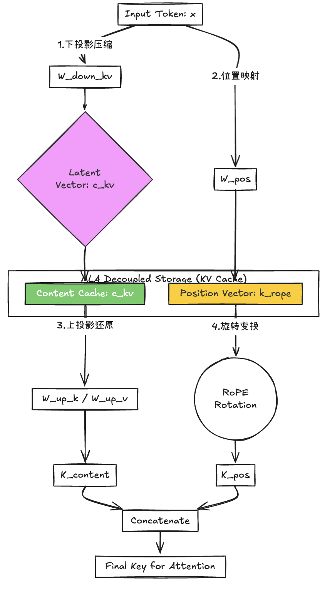
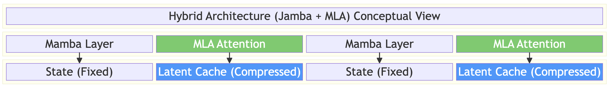

# MLA 深度解析：低秩投影与 KV Cache 的消失魔术

> **摘要**：
> KV Cache 的线性增长是长文本推理的“第一杀手”。
> **MLA (Multi-head Latent Attention)** 是 DeepSeek-V2/V3 的核心创新，通过将 KV 压缩至低维潜在空间，实现了**相对于 MHA 93.3% 的 KV Cache 减小（压缩比约 15x），远超 GQA**。
> 本章将解构 MLA 的低秩投影数学本质，并对比其与 Jamba (Mamba) 在解决显存瓶颈上的不同哲学。数据来源于 DeepSeek 官方报告（arXiv: 2405.04434 & 2412.19437）

## 一、KV Cache 的物理极限与 MLA 的诞生

在传统 Transformer 中，推理速度往往不取决于算力（TFLOPS），而取决于 **内存带宽 (Memory Bandwidth)**。

### 1. 精确显存开销公式

为了更精确地衡量 KV Cache 占用，我们使用以下公式（以字节为单位）：

$$
\text{Mem}_{\text{KV}} = 2 \times L \times N_{\text{layers}} \times (d_{\text{model}} \cdot \frac{n_{\text{kv\_heads}}}{n_{\text{heads}}}) \times \text{precision\_bytes}
$$

其中，对于 Llama-3-70B (GQA)，128k 上下文约占 160GB；而若使用 MHA，该数值将逼近 1TB。

对于 MLA 架构，由于只存储低维潜在向量 $c_t^{KV}$，其显存占用公式变为：

$$
\text{Mem}_{\text{MLA}} = 2 \times L \times N_{\text{layers}} \times d_{\text{latent}} \times \text{precision\_bytes}
$$

其中 $d_{\text{latent}}$ 通常远小于原始维度（如 $d_{\text{latent}} = 512 \ll d_{\text{model}} \times n_{\text{heads}}$）。

**压缩比公式**：

$$
\text{Ratio} = \frac{\text{Mem}_{\text{MLA}}}{\text{Mem}_{\text{KV}}} \approx \frac{d_{\text{latent}}}{d_{\text{model}} \cdot \frac{n_{\text{kv\_heads}}}{n_{\text{heads}}}} \approx \frac{1}{15}
$$

---

## 二、MLA 的核心原理：低秩投影与吸收

MLA 的核心假设是：**KV 矩阵存在极大的特征冗余**。它通过“压缩-存储-动态还原”的流程实现极致减负。

1. **)压缩 (Encode)**：将输入 $x$ 下投影为 512 维的潜在向量 $c_t^{KV}$。
2. **解耦 RoPE (Decoupled RoPE)**：

   * 为了不破坏低秩压缩性，MLA 将 $Q, K$ 分为：不带位置信息的 **Content ($C$)** 和 专门旋转的 **Position ($R$)**。
   * $$
     Q_{t,h} = [q_{t,h}^C; q_{t,h}^R], \quad K_{t,h} = [k_{t,h}^C; k_{t,h}^R]
     $$

     * **Content**：经过低秩压缩，存储在 Latent Cache 中。
     * **Position**：不参与压缩，每层独立生成位置信息，确保旋转矩阵不破坏压缩向量的线性关系。

   **RoPE 的数学形式**：

   $$
   \text{RoPE}(x, m) = x \cdot R_m^T, \quad R_m = \begin{bmatrix} \cos m\theta & -\sin m\theta \\ \sin m\theta & \cos m\theta \end{bmatrix}
   $$

   由于 **RoPE 是正交矩阵**，直接作用于低秩压缩后的 $c_t^{KV}$ 会破坏其线性结构，因此必须将其 **与 Content 分离**。

   

   **RoPE 解耦示意图** **：图解核心：MLA 如何在不破坏位置信息的情况下实现压缩？**

   * **左路（Content 压缩路径）**：输入 $x$ 经过$w_{down}$ **被压入极小的****Latent Vector**（DeepSeek 为 512 维）。在存储（Cache）时，它只占用极小空间。推理时，通过$w_{up}$ **动态还原出高维的 $K_{content}$**
   * **右路（Position 独立路径）**：位置信息$k_{rope}$ **绕过了下投影压缩层**。这是因为 RoPE 旋转操作是线性的，但它依赖于每个 token 的绝对位置。如果在压缩后再旋转，旋转矩阵会破坏低秩矩阵的结构，导致 $w_{up}$ **无法解压。**
   * **解耦存储（Decoupled Storage）**：KV Cache 现在由两部分组成：一份 512 维的“内容精华”和一份专门用于位置匹配的“导航向量”。
   * **终极合并**：在 Attention 计算的前一刻，还原后的内容与旋转后的位置进行 **Concatenate**（拼接），生成最终的 Key。
3. **矩阵吸收 (Matrix Absorption)**：

   * 在推理时，利用矩阵结合律，将上投影矩阵 $W_{UK}$ 提前合并到 $W_Q$ 中。
   * **数学前提**：该优化**依赖投影过程的无非线性（无 Activation 层）**，从而确保结合律成立。
   * **权衡 (Trade-off)**：虽推理效率极高，但 MLA 在训练阶段会增加计算量。实测显示，MLA 的训练计算量约增加 **15–20%**（主要来自 $W_{\text{down}}$ 和 $W_{\text{up}}$ 的额外矩阵乘法），但推理时的 **FLOPs 减少 90%**，整体 **ROI（投资回报率）极高**。

---

## 三、为什么 MLA 这么强？（多维度横评）

MLA 实际上是在不改变 Transformer 本质的前提下，将 KV Cache 的效率推向了物理极限。

| 维度                    | **传统 MHA (Llama 2)** | **GQA (Llama 3)** | **MLA (DeepSeek-V3)**        |
| :---------------------- | :--------------------------- | :---------------------- | :--------------------------------- |
| **KV Cache 占用** | 100% (极高)                  | 12.5% - 25% (中)        | **剩余约 6.7% (93.3% 减小)** |
| **推理速度**      | 慢 (受内存带宽限制)          | 较快                    | **极快 (显存读写压力骤降)**  |
| **模型能力**      | 基准线                       | 略有损耗                | **几乎无损 (甚至更强)**      |
| **显存利用率**    | 128k 需 8 卡 H100            | 128k 需 2 卡 H100       | **128k 仅需 1 卡 H100**      |

**压缩比计算**：

$$
\text{Compression Ratio} = \frac{n_{\text{heads}} \times d_{\text{head}}}{d_{\text{latent}}} = \frac{128 \times 128}{512} = 32
$$

实际工程中，由于需保留 RoPE 的位置向量（维度约 $d_{\text{head}}$），有效压缩比约为 $\approx 15\text{x}$。

---

## 四、巅峰对决：MLA vs. Jamba (Hybrid SSM)

### 1. 技术路线对比

* **Jamba (Mamba 派)**：**根源消灭法**。直接用 SSM 层替换掉约 87.5% 的 Attention 层。大部分层根本不产生 KV Cache。
* **MLA (DeepSeek 派)**：**极致压缩法**。保留全量 Attention，但在数学上将每个 Token 存储的 KV 维度从数万维压至数百维。

### 2. 深度对比表

| 特性                         | **Jamba (Hybrid SSM)**   | **MLA (Pure Transformer)**     |
| :--------------------------- | :----------------------------- | :----------------------------------- |
| **对 KV Cache 的态度** | **跳过**：大部分层无缓存 | **压缩**：所有层都有缓存但极小 |
| **推理复杂度**         | $O(L)$ 线性增长速度更慢      | $O(L^2)$ 但系数被压得极低          |
| **擅长领域**           | 超长流式输入、无限 Context     | 复杂逻辑推理、精确指令遵循           |
| **工程难度**           | 极高 (需专用 Fused Kernel)     | 中 (兼容主流算子，需优化推理框架)    |

### 3. 工程挑战 (Engineering Challenges)

* 需要 **自定义 CUDA Kernel** 以支持低秩 KV 的高效解压（DeepSeek 使用了 **FlashAttention-2 + MLA 专用优化**）。
* **vLLM 0.4.0+** 已原生支持 MLA，但早期版本需手动修改 `attention.py`。
* 训练时的额外计算开销约为：$\text{Extra FLOPs} \approx 2 \times L \times d_{\text{model}} \times d_{\text{latent}} \times (N_{\text{layers}} - N_{\text{attn}})$。

---

## 五、总结与构想

**结论**：MLA 的本质是用**低秩假设**换取**工程效率**。它证明了在不放弃 Attention 强大建模能力的前提下，可以通过矩阵分解将推理成本压低 15 倍以上。

**未来构想**：
如果将 **Jamba 的混合架构** 与 **MLA 的低秩压缩** 结合：

* **Mamba 层**：贡献 0 KV Cache。
* **Attention 层**：利用 MLA 将剩下的少量 Cache 再压缩 15 倍。
* **终极形态的理论显存占用**：

$$
\text{Mem}_{\text{Total}} = \underbrace{\text{Mem}_{\text{Mamba}}}_{\approx 0} + \underbrace{\text{Mem}_{\text{MLA}}}_{\approx 6.7\% \times 12.5\%} \approx \textbf{0.84\%} \text{ of MHA}
$$

这意味着，在 **单张 H100 (80GB)** 上，可流畅推理 **百万级 token** 的超长上下文。

### 决策表

| 场景                     | 技术建议                  |
| :----------------------- | :------------------------ |
| **超长流式对话**   | Jamba                     |
| **复杂逻辑推理**   | MLA                       |
| **消费级显卡部署** | MLA + 量化（如 AWQ/GGUF） |
| **百万级上下文**   | Jamba + MLA (未来)        |

---
