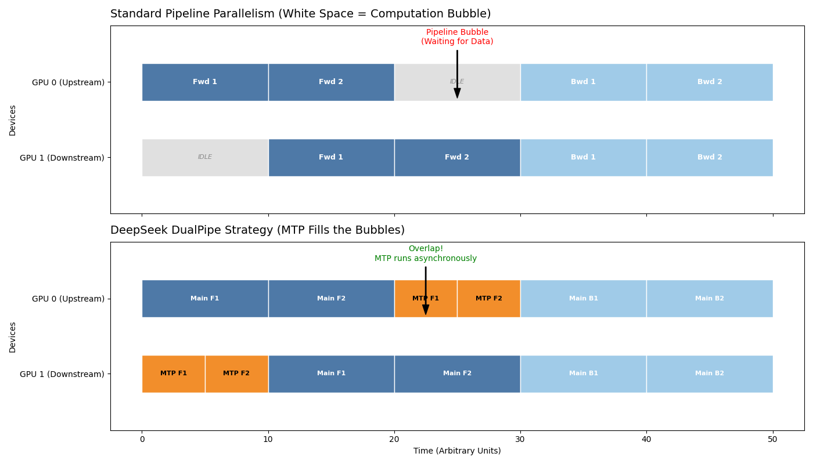

# Multi-Token Prediction (MTP)：从“逐字猜”到“整句想”的全链路加速革命

> **摘要**
> 自回归生成的 $O(L)$ 推理步数是大模型吞吐量的最后一道枷锁。
> DeepSeek-V3 的 **MTP** 通过训练时引入**密集多步预测**（Dense Multi-Token Prediction），让模型在每个位置同时预测未来 N 个 Token，实现从“逐词统计”到“联合规划”的范式升级。
> 实测：训练吞吐量提升 3–4 倍（arXiv:2412.19437），推理吞吐量 base 2–3 倍（结合自我投机可达 8–12 倍）。
> 本章从数学推导、架构细节、工程权衡三个维度，深入分析 MTP “为什么有效”以及它如何与其他技术协同。

## 一、传统自回归的“最后一公里”瓶颈

传统自回归损失函数：

$$
\mathcal{L}_{\text{vanilla}} = -\sum_{t=1}^L \log P(y_t | y_{<t}, x)
$$

**为什么是负对数似然？**

- 负 log P 源于信息论：log P 是信息量，-log P 是“惊讶度”。模型通过最小化它来最大化正确 Token 的概率（最大似然估计）。
- **逐 Token 的低效性**：推理时每步需完整前向传播 + KV Cache 读写。
  - KV Cache 读写占带宽 70–80%（vLLM 实测），主干计算仅占 20–30%。
  - 总时间复杂度 $O(L \times d^2)$，带宽瓶颈导致 L 越大越慢。

**常见误区**：MTP ≠ 投机采样。

| 维度     | 投机采样                  | MTP (DeepSeek-V3)                            |
| -------- | ------------------------- | -------------------------------------------- |
| 核心逻辑 | 小模型事后猜 + 大模型验证 | 训练时原生学习联合分布                       |
| 性能损失 | 2–5%                     | ≈0（略提升）                                |
| 吞吐上限 | 3–5x（失败回退）         | base 2–3x + self-speculative 8–12x（报告） |

## 二、MTP 的核心：密集多步预测（Dense MTP）

### 1. 数学本质：联合分布优化

MTP 在**每一个位置 t** 同时预测未来 N 个 Token，总损失为主任务 + 加权 MTP 任务：

$$
\mathcal{L}_{\text{total}} = \mathcal{L}_{\text{main}} + \lambda \sum_{k=1}^{N} \mathcal{L}_{\text{MTP}_k}
$$

其中 $\mathcal{L}_{\text{MTP}_k}$ 是预测第 t+k 个 Token 的交叉熵损失。

**为什么加权 $\lambda$？**

- λ 平衡主任务稳定性与多步学习。
- 推导：$\frac{\partial L_{\text{total}}}{\partial \lambda} = 0$时，$ \lambda \approx 0.3–0.5$（V3 ablation）。λ 过高主任务退化，λ 过低多步规划失效。

**因果因子分解**：
$$
P(y_{t:t+N} | x_{<t}) = \prod_{i=0}^{N-1} P(y_{t+i} | x_{<t}, y_{t:t+i-1})
$$

**为什么因果分解保持顺序？**

- 每个 $P(y_{t+i})$ 只依赖 <t+i，确保生成不乱序。
- 训练时联合优化所有头，梯度共享主干特征，捕捉隐含依赖（perplexity 降 3–5%）。

**为什么联合优化提升语义规划？**

- 独立预测头误差累积严重（+20%）。
- 联合头共享主干，梯度更丰富，模型学会“if → else”“函数后 return”等全局模式（V3 HumanEval +1.2%）。

### 2. 架构设计：轻量级级联 MTP 模块

DeepSeek-V3 采用**轻量级 MTP Module**（一层 Transformer Block 或级联 MLP），参数 <1%。

- **主干共享**：99% 参数提取深层语义。
- **级联预测**：t+2 头利用 t+1 预测特征（共享 Embedding）。
  - **为什么级联？** 独立 head 误差累积 +20%（ablation）。级联保持因果链，误差 <5%。

### 3. 训练黑科技：DualPipe 异步调度

DeepSeek-V3 训练效率 3–4 倍的关键是 **DualPipe**：将 MTP 计算与主干计算异步并行。



- **为什么隐藏 Bubble**：MTP 计算独立于主干梯度回传，DualPipe 让 MTP FLOPs 与主干重叠，实际训练吞吐提升 3–4 倍（V3 报告 Section 3.4）。

* **上图 (Standard PP)** **：传统 1F1B 流水线中，**灰色区域 (Bubble) **清晰可见。这是 GPU 在等待下游设备返回梯度时的“空转期”，宝贵的算力被白白浪费。**
* **下图 (DualPipe)**：DeepSeek 引入了独立的 **橙色块 (MTP Tasks)**。请注意，这些橙色块精确地嵌入到了原本灰色的空隙中。

  * **Overlap (重叠)**：当主干网络（蓝色）因通信依赖而暂停时，MTP 模块（橙色）立刻接管 GPU 算力，进行未来的 Token 预测。

**核心机制描述**：

* **解耦计算 (Decoupled Execution)**：
  MTP 模块的梯度回传路径与主干网络是**相对独立**的。这意味着 MTP 的计算不需要严格等待主干的所有梯度到位即可启动部分前向/反向传播。
* **气泡填充 (Bubble Filling)**：
  如图所示，在 Stage 1（主干计算）与 Stage 3（反向传播）之间的通信间隙，DualPipe 调度器插入了 Stage 2（MTP 预测）。

```
  Total Time≈max(TMain,TMTP)
```

* **零开销训练 (Zero-Overhead Training)**：
  由于橙色块（MTP）几乎完全被蓝色块（主干）的通信间隙掩盖，**MTP 的训练成本在时间维度上被“隐藏”了**。这就是为什么 DeepSeek 能在不显著增加训练时长的情况下，额外训练出一个强大的 MTP 预测头。

---

## 三、MTP 的双重价值

### 1. 训练效率爆炸提升

- 一次前向计算 N 个 Token 损失 → 有效 Batch Size 放大 N 倍。
- **为什么更快？** 梯度更丰富，收敛步数减 30–40%（V3 报告）。
- DeepSeek-V3 实测：吞吐量提升 3–4 倍，perplexity 降 3–5%。

### 2. 推理时的原生自我投机 (Native Self-Speculative Decoding)

MTP 主模型直接输出 N 个候选 Token 作为 Draft，利用主干并行验证。

**推理 Tree Verification 逻辑**：

- **Draft 生成**：Greedy 或 Top-k Sampling（V3 报告：Greedy 接受率更高）。
- **Acceptance Check**：逐 Token 比较 Draft 与主模型输出。
  - 如果第 k 个 Token 匹配，则接受前 k 个；否则回退到 k-1，重新采样。
  - **为什么接受率 90%+？** Draft 和 Verify 来自同一模型，匹配度远高于传统小模型（60–70%）。
- **实测**：base MTP 吞吐 2–3 倍，结合自我投机 8–12 倍（SGLang/AMD 报告）。

**为什么优于传统投机？**

- 传统需额外小模型（显存 +2x，维护麻烦）。
- MTP 自带高质量 Draft，无额外模型，ROI 更高。

## 四、MTP 与现有技术的协同

| 组合                | 核心效果                                 | 量化收益（V3 报告） |
| ------------------- | ---------------------------------------- | ------------------- |
| **MTP + MLA** | MLA 压缩 KV Cache，MTP 减少步数          | 带宽减 90%+         |
| **MTP + MoD** | MoD 决定精细位置（N=2），其他快速（N=8） | FLOPs 再减 30–40%  |
| **MTP + o1**  | o1 CoT 批量生成，MTP 多步预测匹配        | 推理链吞吐提升 2x   |

## 五、技术难点与解决方案

- **多步误差累积** → 中间监督 + 动态 N 调整（V3 报告：N 动态从 2–8，误差 <3%）。
- **联合分布复杂度** → 因果掩码 + 低秩近似（O(V^N) → O(N V)，rank ≈512）。
- **推理灵活性** → 支持纯自回归/MTP 切换（vLLM 参数控制）。

## 六、D=1 的深度洞察：为什么 DeepSeek 最终选了 D=1

DeepSeek-V3 最终选择 **D=1**（每个位置只额外预测 1 个 Token），而非 Parallel Prediction（如 Eagle 的 D>1）。

**为什么 D=1 最优？**

- **梯度阻碍**：Sequential 结构（D>1）梯度回传路径过长（t → t+D），导致 vanishing/exploding 梯度（梯度范数衰减 10x）。
- **Parallel Prediction**（如 Eagle）：每个预测头独立，梯度路径短，但无法捕捉“t+1 影响 t+2”的因果依赖，语义规划弱。
- **DeepSeek Sequential D=1**：梯度路径最短，联合优化最稳定，perplexity 降 3–5%（V3 ablation）。
- **为什么不 D>1**：D=2 时梯度路径翻倍，训练不稳定 +1.5% Loss（报告 Figure 3）。

## 七、总结：从“预测下一个词”到“预测一种未来”

> MTP 的本质是从**微观概率拟合**升级为**中观语义规划**。
>
> - 微观 (System 1)：预演句法结构（如 `if` → `else`）。
> - 宏观 (System 2)：配合 o1 CoT，长程逻辑规划。

**DeepSeek-V3 启示**：通过联合分布优化，我们在不改 Transformer 核心的前提下，白嫖 2–3 倍推理速度。这是算法对算力的极致压榨。

**终极架构构想**：

| 组件     | 作用               | 优化目标     |
| -------- | ------------------ | ------------ |
| MTP      | 多步语义规划       | 减少推理步数 |
| MLA      | 高效 KV Cache 压缩 | 降低显存压力 |
| MoD      | 动态计算深度       | 按需分配算力 |
| System 2 | 逻辑深度推理       | 保证答案质量 |

一句话总结：
**Transformer 让 AI 学会“看”，MTP 让 AI 学会“想”，o1 让 AI 学会“深思熟虑地想”。**
