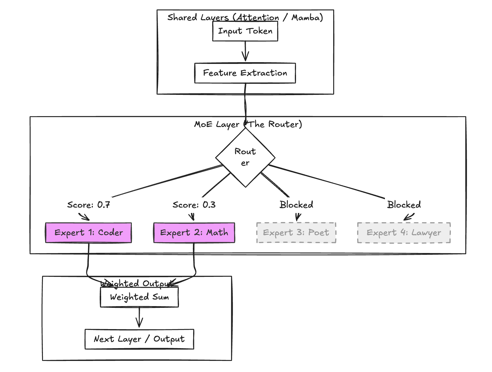

# 稀疏智能体革命：从 Mixture-of-Experts 到 Mixture-of-Agents 的架构跃迁

> **摘要**：
> 随 Scaling Law 演进，稠密模型（Dense）的计算成本已避近物理极限。
> **MoE (混合专家模型)** 通过 Token 级的稀疏激活实现了算力解耦；而 **MoA (混合智能体架构)** 则更进一步，通过模型级的社会化分工打破了单体智能的天花板。
> 本章将解构 MoE 的数学逻辑、Jamba 的工程优势，并探讨将 **Domain-specific Agents** 作为协作单元的未来范式。

### 一、MoE 的工作流程：精准调兵的三个步骤



MoE 的核心在于“按需分配”，其运行逻辑可高度概括为：

### 1. 第一步：路由 (Routing) —— 意图识别

一个称为 **Router (路由器)** 的轻量化模块（通常是单层线性网络）预审输入 Token。

* **决策逻辑**：计算输入向量与各个专家向量的相似度。
* **动作**：识别出“代码、算法”特征，立刻激活 $top\_k=2$ 专家（如程序员 + 数学博士）。

### 2. 第二步：激活 (Activation) —— 局部计算

* **稀疏激活**：选中的 2 位专家（MLP 子网络）进入工作状态，查阅其专有的参数手册；其余 14 位专家（如诗人、律师）保持静默，不消耗计算量。
* **优势**：在拥有巨量参数储备（Knowledge Base）的同时，保持了极低的推理成本（FLOPs）。

### 3. 第三步：加权融合 (Weighted Sum) —— 整合输出

Router 为选中的专家打分（信任分），并将结果按权重求和。

**数学表达**：

$$
\text{Output}(x) = \sum_{i=1}^{K} G(x)_i \cdot E_i(x)
$$

其中：

* $G(x)$：**Noisy Top-K Gating**。通过引入噪声防止“路由坍缩（Router Collapse）”，确保所有专家都能得到训练。
* $E_i(x)$：第 $i$ 个专家的输出。
* $K$：实际激活的专家数（如 2）。

---

## 二、MoE 的核心价值：为什么 Jamba 离不开它？

| 维度               | **传统 Dense 模型 (如 Llama-2)** | **MoE 模型 (如 Jamba)**           | **MoE 的优势**              |
| :----------------- | :------------------------------------- | :-------------------------------------- | :-------------------------------- |
| **模型容量** | 12B 参数$\to$ 能力上限受限           | **52B 总参数** (16 专家 × 3.25B) | 知识量大，长尾事实记忆极强        |
| **推理成本** | 每次计算全部 12B 参数                  | **每次仅算约 12B (激活项)**       | 推理速度极快，显存占用比极优      |
| **专业化**   | “全能修理工”翻万用手册               | **“专家顾问团”定向出列**        | 垂直领域精度（代码/数学）显著提升 |

### 📊 Jamba 的关键工程数据

* **总参数量**：52B（知识储备厚度）。
* **激活参数量**：**12B**（推理计算强度）。
* **Jamba 结论**：其表现远超 13B 稠密模型，但推理速度与显存需求却与 13B 模型相当，实现了“大力出奇迹”与“四两拨千斤”的结合。

---

## 三、生活化类比：全能修理工 vs. 专家顾问团

* **Dense 模型 (稠密)**：像一个“全能修理工”，面对“修自行车”的问题，他需要从头到尾翻阅 1200 页的《万用手册》，效率低下且不够专业。
* **MoE 模型 (Jamba)**：像是一个“高端顾问团”。Router 一听，立刻喊：“自行车技师和机械工程师出列！厨师和律师继续喝茶。”
* **结果**：答案精准、步骤专业，且不浪费无谓的算力。

---

## 四、常见误区与 Jamba 的“稳定性秘诀”

### 1. 常见误区澄清

* **❌ 误区：MoE = 多个模型拼起来？**
  * **✅ 真相**：它是一个统一的单体模型。共享 Embedding 和 Attention/Mamba 层，仅 **MLP (前馈网络) 部分**被替换成了专家组。
* **❌ 误区：MoE 路由是随机的？**
  * **✅ 真相**：Router 是经过学习的决策器。如果 Router 失效（让诗人去写代码），结果会很灾难。

### 2. Jamba 的稳定性秘诀 (The Secret Sauce)

**为什么 Jamba 的决策异常稳健？**
因为它将 MoE 层放在了 **Attention/Mamba 混合层之后**。

* **逻辑**：当 Token 到达 Router 时，已经过 Attention 的全局检索和 Mamba 的长序列建模。
* **后果**：Router 拿到的是包含丰富上下文的“精确语义向量”，而非模糊的原始词。这极大地提高了派发专家的准确率。

---

## 五、前瞻构想：Agentic MoE —— 从隐式专家到显式协作

我们将视角从模型内部（Token-level）移向模型外部（Model-level），即 **Mixture-of-Agents (MoA)**。

### 1. 架构设想：显式领域智能体

将 MoE 的专家升级为专门微调的独立 Agent（如 **Expert-Math**, **Expert-Code**, **Expert-Legal**）。Router 进化为具备强意图分析能力的“中央分发器 (The Orchestrator)”。

### 2. 挑战与缓解策略 (Engineering Trade-offs)

| 挑战                         | 核心瓶颈                | 缓解策略 (Mitigation)                            | 当前主流工具             |
| :--------------------------- | :---------------------- | :----------------------------------------------- | :----------------------- |
| **VRAM 占用极高**      | 同时挂载多个 Agent      | **专家 Lazy Loading** + 模型量化           | vLLM + QLoRA / AWQ       |
| **推理延迟 (Latency)** | 跨 Agent 通信开销       | **异步并行执行** + KV Cache 共享           | Ray + Redis              |
| **输出不一致**         | Agent 风格逻辑冲突      | **Meta-Prompt 聚合** (以底座模型为裁判)    | GPT-4o-mini 作为 Referee |
| **融合不均/饥饿**      | 某个专家被过度/稀疏使用 | **引入辅助损失 (Auxiliary Loss)** 强迫分配 | PyTorch Distributed      |

---

## 六、工程实现思路 (MoA 风格)

这种架构在实践中通常通过多轮迭代和 Aggregator 融合来实现。

```python
# 伪代码：Agentic MoE / MoA 路由逻辑
class AgenticMoERouter:
    def __init__(self, experts):
        self.experts = {
            "math": load_agent("qwen2-math-72b"),
            "code": load_agent("deepseek-coder-v2"),
            "general": load_agent("llama-3.1-70b")
        }
  
    def route(self, prompt):
        # 1. 语义路由：意图提取
        intent = self.analyze_intent(prompt) 
  
        # 2. 显式分发
        selected = [self.experts["general"]]
        if "logic" in intent:
            selected.append(self.experts["code"])
        if "math" in intent:
            selected.append(self.experts["math"])
  
        # 3. 并行执行 (MoA Core)
        responses = [agent.generate(prompt) for agent in selected]
    
        # 4. 融合聚合 (Aggregator Layer)
        return self.aggregate(responses)
```


## 总结与前沿参考

* **Together.ai MoA (2024)**：证明了通过多层开源模型（如 Mixtral + Llama）协作，在 AlpacaEval 上可达 65.1%，超越了当时的 GPT-4o。
* **Sparse Upcycling**：一种将现有稠密模型权重“回收”并初始化为 MoE 专家的方法，大幅缩短训练时间。
* **自迭代 RMoA**：2025 年后的趋势，模型通过自我迭代生成多样性响应并自我路由。
* 2025年后，Self-MoA / RMoA变体开始流行，通过强化学习或多样性最大化路由，实现单模型自演化多Agent协作，进一步降低对多模型挂载的VRAM依赖。

  **结论**：MoE 是单体模型内部的“四两拨千斤”，而 MoA/Agentic MoE 则是模型间“社会化分工”的开始。未来的 AI 系统将不再是孤立的单体，而是一个能够精准识别意图并瞬间调动全球最强专家协作的**超级智能指挥部**。

---
