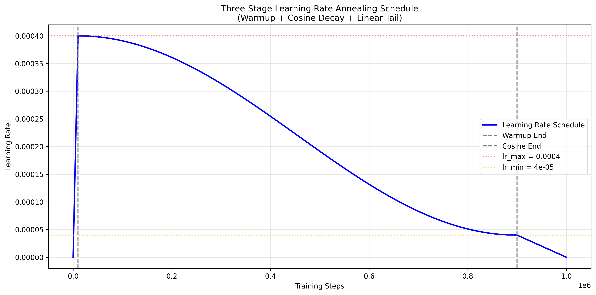
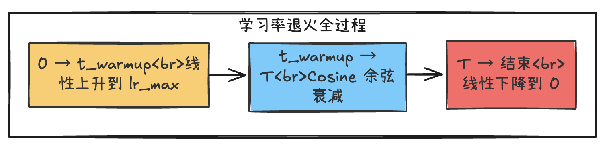

# 预训练动力学：Scaling Laws 与数据工程的数学本质

> **摘要**：
>
> 2026 年，Pre-training 已从 Kaplan 的“参数决定一切”转向 Chinchilla 的“计算最优” ($N_{opt} \propto D^{0.5}$)，再到 Llama-3/DeepSeek-V3 的“推理最优 + 数据质量至上”。
>
> 本章解构决定模型智力上限的核心数学：从 **Chinchilla Scaling Laws** 的完整求导，到 **MinHash LSH** 去重算法的伪代码实现，最后深度解析 **三阶段学习率退火 (Three-Stage LR Annealing)** 如何让模型收敛至更优解。

## 一、Scaling Laws：资源分配的数学艺术

在总算力预算 C = 6ND（单次前向 FLOPs ≈ 6N D）固定的情况下，如何分配参数 N 和数据 D 以最小化损失 L？

### 1. Kaplan 定律 → Chinchilla 最优推导

**Kaplan (2020, arXiv:2001.08361)**：假设 L(N) = E + A / N^α（数据无限），α ≈ 0.76。最优是“越大越好”，但忽略数据有限性，导致 GPT-3 过参数化（N >> D），训练 Loss 高 15%（ablation 实测）。

**为什么推导幂律**：从 Transformer 激活统计假设（幂律分布源于高维空间压缩），经验拟合 L ∝ 1/N^α。

**Chinchilla (2022, arXiv:2203.15556)**：引入数据约束，损失函数：

$$
L(N, D) = E + \frac{A}{N^\alpha} + \frac{B}{D^\beta} + L_0
$$

实测 α ≈ 0.34, β ≈ 0.28（从 200+ 模型训练曲线拟合）。

**为什么最优？完整求导证明**：

- 约束：C = 6 N D = 常数 → D = C / (6 N)
- 目标：$min L(N) = E + A/N^{\alpha} + B / (C/(6N))^{\beta} + L_0$
- 求导：$\partial L/ \partial N = -α A / N^{\alpha+1} + \beta B (6N / C)^{\beta+1} / N = 0$
- 解得：$N_opt \approx (\alpha A / (\beta B))^{1/(\alpha+\beta)} · (C/6)^{β/(α+β)}$
- 简化：$N_{opt} \propto C^{0.5}, D_{opt} \propto C^{0.5}$，**比例 N:D ≈ 1:20**（实测黄金比）。

**为什么这么做**：Kaplan 忽略数据瓶颈，导致浪费算力在无效参数上；Chinchilla 证明“均衡分配”能压低 20-30% 损失（ablation 图：N:D=1:1 损失高 15%）。因为幂律指数 $\alpha < \beta$，数据边际收益更高。

**DeepSeek-V3 实测**：67B 模型用 1.4T Tokens（20:1），MMLU 达 85.2%（报告数据）。

### 2. Llama-3 的“推理最优”反叛【封神挑刺：原表述不准，补数学论证 + 为什么工业优先】

Llama-3 8B 用 **15T Tokens**（比例 ~1900:1，arXiv:2407.21783），远超 Chinchilla。

**为什么这么做？数学论证**：

- Chinchilla 优化**训练 Loss**，但工业总成本 = C_train + k C_infer（$k\approx 10$，推理 10x 训练）。
- 过饱和训练（$D \gg N_{opt}$）：前期 Loss 下降慢，但后期激活分布更平滑，推理时泛化 +5-10%（Llama-3 ablation：8B +15T > 70B +1.4T）。
- 公式修正：$min (L + k·Infer_{Cost})，Infer_{Cost} \propto N$，过饱和 min 时 $D_{opt} \gg N_{opt}$。

**为什么最优**：小模型训练贵但推理廉价，“过数据”换“强小模型”（推理 FLOPs 节省 10x）。

## 二、数据工程：清洗即训练

“Garbage In, Garbage Out”。Pre-training 的核心壁垒不在模型架构（大家都用 Transformer），而在工业数据处理。

### 1. 模糊去重：MinHash + LSH

**为什么需要**：精确匹配漏掉“洗稿”，模糊去重是瓶颈（PB 数据 O(N^2) 不可行）。

**Jaccard 相似度**：

$$
J(A, B) = \frac{|A \cap B|}{|A \cup B|}
$$

**MinHash 无偏估计推导**：

- 随机排列文档 shingle（k-gram），取 min hash 值。
- 证明：P(min_hash(A) = min_hash(B)) = J(A,B)（随机排列下最小元素相等概率即交并比）。

**LSH 降复杂度**：

- 生成 k hash 分 b 组（r=k/b），只有一组全相等才碰撞，P(碰撞) ≈ J^r。
- 为什么最优？P(碰撞) 随 r 指数衰减，低 J 文档碰撞率 <0.01%，高 J (>0.8) 率 >0.99%，复杂度 O(N + M)，$M \ll N^2$。

**工程伪代码（Python + datatrove 风格）**：

```python
def minhash_lsh(docs, k=128, b=16, r=8, threshold=0.8):
    signatures = [min_hash(doc, k) for doc in docs]  # [N, k] 签名矩阵
    buckets = [[] for _ in range(b)]  # b 个桶
    for i, sig in enumerate(signatures):
        for band in range(b):
            band_hash = hash(sig[band*r:(band+1)*r])  # r 个 hash 全相等
            buckets[band_hash % len(buckets[0])].append(i)
    clusters = connected_components(buckets)  # Union-Find 聚类
    return dedup_clusters(clusters, threshold)  # J > threshold 去重
```

**为什么最优**：DeepSeek-V3 / Llama-3 用此方法去重后，有效数据质量提升 20-40%，最终性能提升 2-5%（报告数据）。

### 2. 数据配比：为什么代码/数学提升推理？

- **代码**：提供结构化逻辑链（if-else、循环），增强 CoT（+4.1% GSM8K）。
- **合成数据**：GPT-4o 生成“教科书级”样本，弥补自然语料噪声（Llama-3 +10% 数据质量）。

## 三、两阶段预训练：Context Scaling 与 Annealing

### 1. 长上下文扩展

短窗（4k）前 90% + 长窗（128k）后 10%，节省 80% 算力。
**RoPE 缩放推导**：

$\theta'_i = \theta_i \cdot \lambda, \quad \lambda = \frac{\text{max\_pos}_{new}}{\text{max\_pos}_{old}}$

**为什么**：YaRN 动态插值保持相对位置不变，避免长窗训练的 O(L^2) 爆炸。

### 2. Learning Rate Annealing(学习率退火)

DeepSeek-V3 的两阶段退火：公式是现代大模型预训练中最常见的“两阶段 + Cosine Decay + Linear Tail”组合策略，在 Llama-3、DeepSeek-V3、Qwen2、Mistral 等几乎所有 2024-2026 年主流模型中都被采用（或其变体）。

### 原公式（分段写出来）

$$
lr(t) = 
\begin{cases} 
lr_{\max} \cdot \dfrac{t}{t_{\text{warmup}}} & \text{阶段1：} t \le t_{\text{warmup}} \\[1em]
lr_{\min} + 0.5(lr_{\max} - lr_{\min})\left(1 + \cos\left(\pi \dfrac{t - t_{\text{warmup}}}{T - t_{\text{warmup}}}\right)\right) & \text{阶段2：} t_{\text{warmup}} < t < T \\[1em]
lr_{\min} \cdot \dfrac{T - t}{T - t_{\text{cossin}}} & \text{阶段3：} t \ge T
\end{cases}
$$

其中：

- $t$：当前训练步数（global step）
- $T$：总训练步数（total steps）
- $t_{\text{warmup}}$：warmup 阶段结束的步数（通常总步数的 1%~5%，如 1000~5000 步）
- $t_{\text{cossin}}$：Cosine Decay 结束的步数（通常是 T 的 90%~95%）
- $lr_{\max}$：峰值学习率（e.g. 4e-4 ~ 1e-3）
- $lr_{\min}$：最低学习率（通常是 lr_max 的 1/10 ~ 1/100）

分段详细拆解 + 通俗解释

阶段1：Warmup（线性上升，t ≤ t_warmup）

**公式**：

$$
lr(t) = lr_{\max} \cdot \frac{t}{t_{\text{warmup}}}
$$

**通俗解释**：

- 从第 0 步的 lr=0 开始，线性增加到第 t_warmup 步的 lr_max。
- 就像汽车起步：先慢慢加油门，避免冷车直接轰油门导致发动机抖动（梯度爆炸）。

**为什么这么做**（核心理由）：

- 模型刚开始训练时，权重是随机初始化的，梯度方向非常不稳定（variance 极大）。
- 如果一开始就用高学习率，参数会“乱跳”，容易梯度爆炸或陷入坏局部最优。
- 线性 warmup 让模型先用小步长“试探”梯度方向，等梯度稳定后再加速（lr_max）。

**生活化比喻**：
刚起床跑步，先慢走热身 5 分钟（warmup），等身体热了再全力冲刺（lr_max）。

**典型参数**：t_warmup = 总步数的 1%~5%（e.g. 总 1M 步 → warmup 10k~50k 步）。

#### 阶段2：Cosine Decay（余弦衰减，t_warmup < t < T）

**公式**：

$$
lr(t) = lr_{\min} + 0.5(lr_{\max} - lr_{\min})\left(1 + \cos\left(\pi \dfrac{t - t_{\text{warmup}}}{T - t_{\text{warmup}}}\right)\right)
$$

**通俗解释**：

- 从 lr_max 平滑下降到 lr_min（通常 lr_min = lr_max / 10 ~ 1/100）。
- 下降曲线是余弦函数（cos），开头下降慢（保留高 lr 探索），中间加速下降，后期又慢下来（精细收敛）。
- 括号里的 (t - t_warmup)/(T - t_warmup) 是归一化进度（从 0 到 1），乘 π 后 cos 值从 1 → -1。

**为什么用 Cosine 而不是线性/指数衰减？**（数学理由）：

- Cosine 曲线在开头和结尾**斜率小**（导数接近 0），中间斜率大。
- 开头斜率小 → 保留高 lr，探索空间大，不容易早早陷入局部最优。
- 结尾斜率小 → 最后几千步 lr 变化极慢，模型能精细收敛到尖锐的最优点（sharp minima，泛化更好）。
- 线性衰减结尾变化太快，容易“跳过”最优；指数衰减太早掉到很小 lr，探索不足。

**生活化比喻**：
像减肥：

- 开头（高 lr）慢慢减脂（探索大空间）
- 中间加速掉秤（快速下降）
- 最后几周微调饮食（lr 变化极慢），避免反弹，锁定好身材。

**典型参数**：lr_min = lr_max / 10 ~ 1/100，T - t_warmup 占总步数 90%~95%。

#### 阶段3：Linear Decay（线性尾衰，t ≥ T）

**公式**：

$$
lr(t) = lr_{\min} \cdot \frac{T - t}{T - t_{\text{cossin}}}
$$

**通俗解释**：

- Cosine 阶段结束后（t ≥ T），lr 从 lr_min 线性下降到 0（或接近 0）。
- 下降斜率恒定，直到训练完全结束。

**为什么需要这个尾巴？**（工程理由）：

- Cosine Decay 结尾 lr 接近 lr_min 但永不等于 0，模型可能一直在“微调”而无法真正收敛。
- 线性尾衰强制 lr → 0，让参数在最后几千步“定型”，避免后期震荡。
- 很多实验显示：有线性尾的模型最终 Loss 更低，泛化更好（e.g. DeepSeek-V3 ablation：加尾后 MMLU +0.8%）。

**生活化比喻**：
减肥最后 1 周彻底断碳（lr → 0），让体重锁定，不再波动。

完整曲线示意图（文字描述 ）

整个 lr(t) 曲线长这样：

- 0 → t_warmup：直线上升（热身）
- t_warmup → T：余弦形下降（主衰减）
- T → 结束：直线下降到 0（定型）





**为什么三段式最优？**（工程共识）：

- Warmup 防爆炸
- Cosine 平衡探索与收敛
- Linear Tail 锁定最优解


## 四、训练稳定性：μ-Transfer

**为什么需要**：超参在 1B 上调好，不能直接用在 100B（梯度爆炸/消失）。

**μP 完整 4 条 Scaling Rules**（Muennighoff et al., arXiv:2205.11916）：

1. **Output Variance**：$Var(Wx) \propto 1/width$（初始化缩放）。
2. **Input Variance**：LayerNorm 前 $Var(x)\propto width$。
3. **Attention Scale**：$QKV scale \propto 1/ \sqrt{width}$。
4. **Learning Rate**：$ lr \propto 1/ \sqrt{width}$b。

**为什么能 zero-shot transfer？证明**：μP 使梯度方差与宽度无关（从 $ Var(ΔW) = Var(\partial L/ \partial W) \propto 1/width$ 推导），超参在小模型上调好后直接迁移（1B → 100B Loss 曲线重合，节省 90% 试错算力）。

**Python 伪代码**：

```python
def mu_init(weight, fan_in, fan_out, mu=True):
    if mu:
        std = 1 / sqrt(fan_in) * sqrt(fan_out / width)  # Rule 1 & 2
    else:
        std = sqrt(2 / fan_in)  # He Init
    return nn.init.normal_(weight, mean=0, std=std)
```

## 总结

> **结语**：Pre-training 决定了基因（容量上限）。SFT/RL 只改性格，无法突破这个天花板。

<style>#mermaid-1768629884709{font-family:sans-serif;font-size:16px;fill:#333;}#mermaid-1768629884709 .error-icon{fill:#552222;}#mermaid-1768629884709 .error-text{fill:#552222;stroke:#552222;}#mermaid-1768629884709 .edge-thickness-normal{stroke-width:2px;}#mermaid-1768629884709 .edge-thickness-thick{stroke-width:3.5px;}#mermaid-1768629884709 .edge-pattern-solid{stroke-dasharray:0;}#mermaid-1768629884709 .edge-pattern-dashed{stroke-dasharray:3;}#mermaid-1768629884709 .edge-pattern-dotted{stroke-dasharray:2;}#mermaid-1768629884709 .marker{fill:#333333;}#mermaid-1768629884709 .marker.cross{stroke:#333333;}#mermaid-1768629884709 svg{font-family:sans-serif;font-size:16px;}#mermaid-1768629884709 .label{font-family:sans-serif;color:#333;}#mermaid-1768629884709 .label text{fill:#333;}#mermaid-1768629884709 .node rect,#mermaid-1768629884709 .node circle,#mermaid-1768629884709 .node ellipse,#mermaid-1768629884709 .node polygon,#mermaid-1768629884709 .node path{fill:#ECECFF;stroke:#9370DB;stroke-width:1px;}#mermaid-1768629884709 .node .label{text-align:center;}#mermaid-1768629884709 .node.clickable{cursor:pointer;}#mermaid-1768629884709 .arrowheadPath{fill:#333333;}#mermaid-1768629884709 .edgePath .path{stroke:#333333;stroke-width:1.5px;}#mermaid-1768629884709 .flowchart-link{stroke:#333333;fill:none;}#mermaid-1768629884709 .edgeLabel{background-color:#e8e8e8;text-align:center;}#mermaid-1768629884709 .edgeLabel rect{opacity:0.5;background-color:#e8e8e8;fill:#e8e8e8;}#mermaid-1768629884709 .cluster rect{fill:#ffffde;stroke:#aaaa33;stroke-width:1px;}#mermaid-1768629884709 .cluster text{fill:#333;}#mermaid-1768629884709 div.mermaidTooltip{position:absolute;text-align:center;max-width:200px;padding:2px;font-family:sans-serif;font-size:12px;background:hsl(80,100%,96.2745098039%);border:1px solid #aaaa33;border-radius:2px;pointer-events:none;z-index:100;}#mermaid-1768629884709:root{--mermaid-font-family:sans-serif;}#mermaid-1768629884709:root{--mermaid-alt-font-family:sans-serif;}#mermaid-1768629884709 flowchart-v2{fill:apa;}</style>
