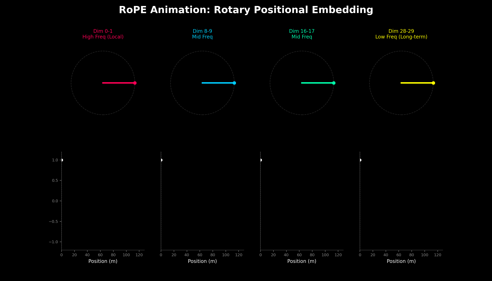

# RoPE (Rotary Positional Embedding) 详解：相对位置编码的终极标准

> **摘要**：
> 传统的 Transformer 使用相加（Addition）方式注入位置信息（如 Sin/Cos PE）。
> **RoPE** 彻底改变了范式：它通过将向量在复平面上**旋转**，使得 Query 和 Key 的点积（Attention Score）仅依赖于它们的**相对距离** $(m-n)$。
> 它是 LLaMA、Mistral、Qwen、DeepSeek 等现代大模型的**绝对标配**，也是长文本扩展（Long Context）的数学基础。

---

## 📐 一、核心数学直觉：为什么是旋转？

### 1. 痛点：绝对位置 vs 相对位置

* **绝对位置 (Sin/Cos Add)**: $x_m = x + p_m$。

  * Attention 计算时：$q_m^T k_n = (x_q + p_m)^T (x_k + p_n)$。
  * *缺陷*：展开后包含 $p_m^T x_k$ 等杂项，模型难以直接解耦出“相对距离”。
* **理想目标**: 我们希望 Attention 分数 $Score(q, k)$ 满足：

  $$
  \text{Score}(f(q, m), f(k, n)) = g(q, k, \mathbf{m-n})
  $$

  即：分数只受 **相对距离** 控制，与绝对位置无关。

### 2. 二维旋转推导

在 2D 平面上，向量 $\mathbf{x}$ 可以看作复数。如果我们将向量旋转角度 $m\theta$：

$$
f(x, m) = x \cdot e^{im\theta}
$$

当计算 $q$ (位置 $m$) 和 $k$ (位置 $n$) 的点积（内积）时，利用复数性质：

$$
\langle f(q, m), f(k, n) \rangle = \text{Re}(q e^{im\theta} \cdot (k e^{in\theta})^*)
$$

$$
= \text{Re}(q e^{im\theta} \cdot k^* e^{-in\theta})
$$

$$
= \text{Re}(q k^* e^{i(m-n)\theta})
$$

**结论**：结果中只包含 $(m-n)$。**旋转操作从数学上完美保留了相对位置信息。**

---

## 🧮 二、工程实现：高维推广

### 1. 分而治之 (Divide and Conquer)

大模型的 Embedding 维度 $d$ (如 4096) 很大。RoPE 的策略是：**两两分组**。
将向量切分为 $d/2$ 个子空间，每个子空间独立旋转。

对于位置 $m$，第 $i$ 组 (维度 $2i, 2i+1$) 的旋转矩阵 $\mathbf{R}_{\Theta, m}^d$ 为：

$$
\begin{pmatrix} x_{2i}' \\ x_{2i+1}' \end{pmatrix} = 
\begin{pmatrix} 
\cos m\theta_i & -\sin m\theta_i \\ 
\sin m\theta_i & \cos m\theta_i 
\end{pmatrix} 
\begin{pmatrix} x_{2i} \\ x_{2i+1} \end{pmatrix}
$$

### 2. 频率设定与视觉直觉 ($\Theta$)



旋转需要一个角速度 $\theta$。为了覆盖不同距离的依赖，使用了多组不同频率的 $\theta_i$。为了与代码保持一致，我们将其写为倒数形式：

$$
\theta_i = \frac{1}{10000^{2i/d}}
$$

**🕰️ 视觉直觉：多频率时钟**

想象 embedding 向量由一排不同转速的指针组成：

* **低频分量 (i=0)**: $\theta \approx 1$。转速极快。这就像时钟的**秒针**。它对细微的位置变化非常敏感，负责捕获**局部关系**（比如 adjacent token）。
* **高频分量 (i=d/2)**: $\theta \approx 1/10000$。转速极慢。这就像时钟的**时针**。它转一圈需要经过很长的距离，负责捕获**长距离依赖**。

这种“快慢指针”的组合，让模型既能看清脚下，也能眺望远方。

---

## 💻 三、PyTorch 代码实战

RoPE 为了效率，**不使用矩阵乘法**，而是使用逐元素操作实现旋转。

公式变形（复数乘法的实数形式）：

$$
\begin{pmatrix} x_1 \\ x_2 \end{pmatrix} \otimes \begin{pmatrix} \cos \\ \cos \end{pmatrix} + \begin{pmatrix} -x_2 \\ x_1 \end{pmatrix} \otimes \begin{pmatrix} \sin \\ \sin \end{pmatrix}
$$

```python
import torch

def precompute_freqs_cis(dim: int, end: int, theta: float = 10000.0):
    """
    预计算 cos 和 sin 值 (缓存 Cache)
    返回形式为复数 (cos + i*sin)，方便后续计算
    """
    # 1. 计算 theta_i: 1 / 10000^(2i/d)
    # 这里的公式写法与数学部分保持完全一致
    freqs = 1.0 / (theta ** (torch.arange(0, dim, 2)[: (dim // 2)].float() / dim))

    # 2. 生成位置索引 t: 0, 1, ..., end
    t = torch.arange(end, device=freqs.device)

    # 3. 外积生成 m * theta
    freqs = torch.outer(t, freqs).float()  # shape: (end, dim/2)

    # 4. 转为复数形式: e^(i * m * theta) = cos + i*sin
    freqs_cis = torch.polar(torch.ones_like(freqs), freqs)
    return freqs_cis

def apply_rotary_emb(xq, xk, freqs_cis):
    """
    应用 RoPE 到 Query 和 Key
    xq, xk shape: (batch, seq_len, n_head, head_dim)
    """
    # 1. 将 float32 变形为复数 View: (..., head_dim) -> (..., head_dim/2, 2) -> Complex
    xq_ = torch.view_as_complex(xq.float().reshape(*xq.shape[:-1], -1, 2))
    xk_ = torch.view_as_complex(xk.float().reshape(*xk.shape[:-1], -1, 2))

    # 2. 广播机制匹配维度
    # freqs_cis shape: (seq_len, head_dim/2) -> 需要广播到 batch 和 n_head
    ndim = xq_.ndim
    assert 0 <= 1 < ndim
    assert freqs_cis.shape == (xq_.shape[1], xq_.shape[-1])
    shape = [d if i == 1 or i == ndim - 1 else 1 for i, d in enumerate(xq_.shape)]
    freqs_cis = freqs_cis.view(*shape)

    # 3. 复数乘法 (即旋转操作)
    xq_out = torch.view_as_real(xq_ * freqs_cis).flatten(3)
    xk_out = torch.view_as_real(xk_ * freqs_cis).flatten(3)

    return xq_out.type_as(xq), xk_out.type_as(xk)
```

### 🛠️ 关键工程细节 (MQA/GQA 适配)

1. **只对 Q, K 操作**：$value (v)$ 不需要位置编码。
2. **缓存 (Caching)**：`cos` 和 `sin` 表非常大，通常在模型初始化时计算一次 (`freqs_cis`)，推理时直接查表。
3. **GQA/MQA 场景**：
   * 在 Grouped Query Attention (GQA) 或 Multi-Query Attention (MQA) 中，Key (K) 的 Head 数量远少于 Query (Q)。
   * **RoPE 是应用在 `head_dim` 上的**。尽管 Q 和 K 的 Head 数量不同，但它们的 `head_dim` (例如 128) 是必须一致的。因此，RoPE 代码可以直接广播应用，不受 Head 数量差异的影响。

---

## 🚀 四、长文本扩展 (RoPE Scaling)

**RoPE 的一大优势是 Extrapolation (外推) 能力，是实现 128k 上下文的核心。**

### 1. 线性插值 (Linear Scaling)

假设训练长度 $L=2048$，现在要推理 $L'=4096$。
如果我们直接外推，位置索引 $m$ 会超出训练范围。线性插值的思路是“把长尺子压缩进短刻度”：

$$
m' = \frac{m}{\kappa}
$$

其中 $\kappa$ 是扩展倍数。这解决了越界问题，但带来了**分辨率损失**——这相当于把高频振荡的波拉长了，导致模型在分辨相邻 Token 时的敏锐度下降（Perplexity 变差）。

### 2. NTK-Aware Scaling (进阶)

为了解决线性插值的“高频信息丢失”问题，NTK-Aware 方法引入了非线性变换。Neural Tangent Kernel 该公式来源于对 Transformer 在无限宽极限下的 NTK 分析

* **直觉**：

  * **高频部分**（转得快的）：不需要插值，直接外推就行（因为转得快，稍微转一点点相位就变了很多，模型能泛化）。
  * **低频部分**（转得慢的）：必须插值，否则转一圈需要的位置太远，模型没见过。
* **数学实现 (Base Change)**：
  我们不直接修改位置索引 $m$，而是修改计算频率的基数 (Base) $b=10000$。
  令新基数为 $b' = b \cdot \alpha$。根据 NTK 理论推导，为了在扩展 $\kappa$ 倍长度时保持高频分量不变，我们需要增加 Base：

  $$
  b' = b \cdot \kappa^{\frac{d}{d-2}}
  $$
* **结果**：
  通过增大 Base，我们有效地让所有频率“转得更慢”了，从而在不压缩高频分辨率的情况下，容纳了更长的上下文。这就是为什么 CodeLlama 等模型能轻松做到 100k+ 长度的原因。
* **Dynamic NTK**：
  在实际推理中，根据当前的序列长度 $L_{current}$ 动态计算 $\kappa = L_{current} / L_{train}$，实时调整 Base，效果更佳。

---

## 🧭 总结：为什么 RoPE 赢了？

| 特性               | Sin/Cos (Original)       | ALiBi (Bias)          | RoPE (Llama)                           |
| :----------------- | :----------------------- | :-------------------- | :------------------------------------- |
| **操作方式** | **加法** ($x+p$) | 加 Bias ($score+b$) | **乘法/旋转** ($xe^{i\theta}$) |
| **外推性**   | 差                       | 好                    | **极好** (配合 NTK Scaling)      |
| **计算位置** | Input Layer              | Attention Score       | **Attention Q/K**                |

**一句话总结**：

RoPE 将位置信息编码为**旋转角度**，使得 Transformer 在做点积时能自然地捕捉 Token 之间的**相对距离**，配合 **NTK-Aware Scaling**，它成为了当前大模型处理无限长上下文的数学基石。
