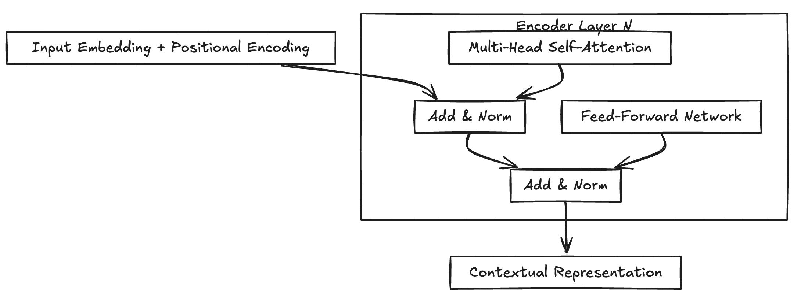

# Transformer Encoder 详解

### Encoder 总览

这就是 Encoder 的全部！它就像一个**语义提炼机**，输入一串字，输出一串包含深层语义的向量。

---

### 一、Encoder 单层完整结构：现代 vs 经典

现在主流大模型（LLaMA, PaLM, DeepSeek）的 Encoder/Block 设计，已经与 2017 年的原始论文有了显著进化。

#### 1. 结构对比表

| 特性                 | 🏛️ 经典架构 (BERT/RoBERTa)     | 🚀 现代架构 (LLaMA/PaLM/GLM)              |
| :------------------- | :------------------------------- | :---------------------------------------- |
| **归一化位置** | **Post-LN** (先加后归一化) | **Pre-LN** (先归一化后加)           |
| **归一化算法** | LayerNorm                        | **RMSNorm** (去中心化，更稳更快)    |
| **激活函数**   | GELU / ReLU                      | **SwiGLU** (门控线性单元，效果更强) |
| **位置编码**   | Learnable / Sinusoidal           | **RoPE** (旋转位置编码，外推性强)   |
| **稳定性**     | 深层容易梯度爆炸，需 Warmup      | 极度稳定，可轻松训练 100+ 层              |

#### 2. 代码实现 (Pre-LN 范式)

```python
class EncoderLayer(nn.Module):
    def forward(self, x):
        # 1. Self-Attention 分支 (Pre-LN)
        # 这里的 norm 通常是 RMSNorm
        residual = x
        x = self.norm1(x)
        x = residual + self.attn(x)  # 残差连接
      
        # 2. FFN 分支 (Pre-LN)
        residual = x
        x = self.norm2(x)
        x = residual + self.ffn(x)   # 残差连接
      
        return x
```

---

### 二、Encoder 每一部分到底在算什么？

#### 1. 输入阶段 (Input Stage)

$$
\text{Input} = \text{WordEmbedding} + \text{PositionalEncoding}
$$

* **Word Embedding**: 查表得到词向量（如 512 维）。
* **Positional Encoding**:
  * **绝对位置** (BERT): 学习出来的 Position Embedding。
  * **相对位置** (RoPE): 目前 SOTA 标准。通过**旋转向量的角度**来注入位置信息，让模型理解 `距离`。

#### 2. 核心：多头自注意力 (Multi-Head Self-Attention)

这是 Encoder 的灵魂。一个 Token 能 `看见`整句话，全靠它。

$$
\text{Attention}(Q,K,V) = \text{softmax}\left( \frac{Q K^T}{\sqrt{d_k}} + \color{red}{\text{M}_{\text{pad}}} \right) V
$$

* $\sqrt{d_k}$: **缩放因子**。防止点积过大导致 Softmax 梯度消失。
* $\color{red}{\text{M}_{\text{pad}}}$ (**Padding Mask**):
  * **关键点**：Encoder 是**双向**的，可以看到全文。
  * **作用**：仅仅是为了 Mask 掉 `<pad>` 占位符（通常设为 $-\infty$），防止模型把注意力浪费在无意义的填充上。
* **FlashAttention**: 现代工程必备。通过显存 IO 优化，在不改变数学结果的前提下实现 **3-5 倍加速**。

#### 3. 深度变换：前馈网络 (FFN / MLP)

注意力机制负责 `聚合信息`，FFN 负责 `消化信息`（非线性变换）。

**经典写法 (BERT)**:

$$
\text{FFN}(x) = \text{GELU}(x W_1 + b_1) W_2 + b_2
$$

*(维度变化: $d \to 4d \to d$)*

**现代写法 (SwiGLU)**:

$$
\text{SwiGLU}(x) = (\text{Swish}(x W_g) \otimes (x W_{in})) W_{out}
$$

*(维度变化: $d \to \frac{8}{3}d \to d$)*

> **注**：为了保持参数量与经典 FFN 一致，中间层维度通常缩小为原来的 $\frac{2}{3}$。

---

### 三、Encoder 最终输出了什么？

经过 $N$ 层堆叠后，输出矩阵形状为：

$$
\boxed{(\text{Batch}, \text{Seq\_Len}, \text{Hidden\_Dim})}
$$

每一行向量，都是当前 Token 融合了**整条序列全部信息**后的**深度上下文表示 (Contextual Representation)**。

#### 举个栗子 🌰

输入：`[我, 爱, 吃, 苹, 果]`
在第 12 层输出中，**`我`** 这个位置的向量，已经不仅仅代表 `我`这个字，它还隐含了：

1. 动作对象是 `苹果`。
2. 情感色彩是 `爱`。
3. 语法角色是 `主语`。

**如何使用这个输出？**

* **分类任务**: 取 `[CLS]` 标记的向量，或对所有向量取平均 (Mean Pooling)。
* **序列标注**: 对每个 Token 的向量接一个分类头 (如 NER 实体识别)。

---

### 四、经典模型参数配置

| 模型                 | 类型    | Layers | Heads | $d_{model}$ | 位置编码  | 架构特点                            |
| :------------------- | :------ | :----- | :---- | :------------ | :-------- | :---------------------------------- |
| **BERT-Base**  | Encoder | 12     | 12    | 768           | Learnable | Post-LN                             |
| **BERT-Large** | Encoder | 24     | 16    | 1024          | Learnable | Post-LN                             |
| **RoBERTa**    | Encoder | 24     | 16    | 1024          | Learnable | Post-LN (优化了训练策略)            |
| **ViT-Huge**   | Encoder | 32     | 16    | 1280          | Learnable | **Pre-LN** (视觉 Transformer) |

---

### 五、一句话总结

**Encoder 的本质工作流：**

1. **全局咨询 (Self-Attention)**：拿着自己的问题去问句子里所有人，聚合信息。
2. **深度反思 (FFN)**：把问到的信息结合自己的理解，进行非线性加工。
3. **最终目标**：把**`含糊的字面输入`**变成** `精确的语义理解`**。
