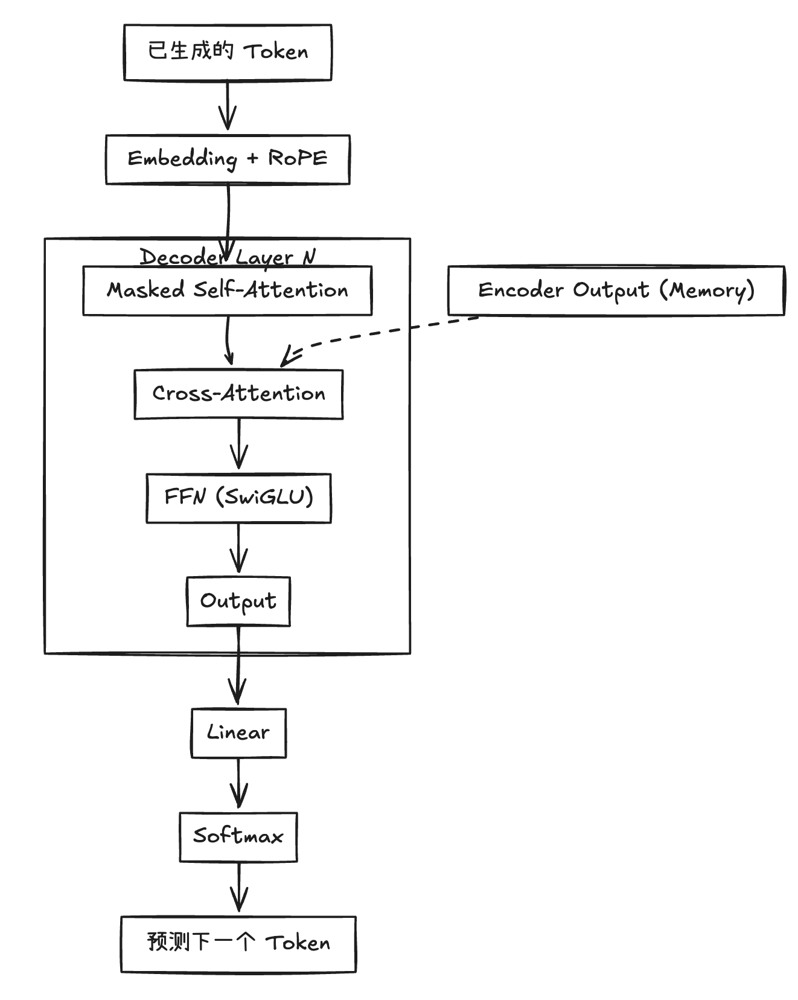

# Transformer Decoder 详解

### 🏗️ Decoder 总览

Decoder 的任务是**自回归 (Auto-Regressive)** 地逐个生成 Token。它就像一个作家，左手拿着 Encoder 给的`提纲`（Context），右手写着`小说`（Generated Sequence），每写一个字都要回头看自己之前写了什么。



---

### ⚙️ 一、Decoder 单层完整结构：现代 SOTA (Pre-LN)

现代 LLM（如 LLaMA, GPT-4）通常采用 **Decoder-Only** 架构（移除了 Cross-Attention），而传统的 Transformer（如 T5, MarianMT）采用 **Encoder-Decoder** 架构。

#### 1. 结构公式表 (Pre-LN 范式)

| 步骤 | 子模块 | 核心公式 (Pre-LN) |
| :--- | :--- | :--- |
| **1** | **Masked Self-Attention**<br>回顾历史，保持逻辑一致性 | $x_1 = x + \text{MaskedMHA}(\text{RMSNorm}(x))$ |
| **2** | **Cross-Attention** (可选)<br>查询原文，获取上下文信息 | $x_2 = x_1 + \text{CrossAttn}(\text{RMSNorm}(x_1), \text{EncOut})$ |
| **3** | **FFN (SwiGLU)**<br>深度思考，整合信息 | $x_3 = x_2 + \text{SwiGLU}(\text{RMSNorm}(x_2))$ |

> **💡 Pre-LN 的数学优势**：
> 主干路径（Residual Path）是 $x + f(x) + g(x) \dots$，导数始终包含恒等项 $1$。这保证了梯度流在深层网络中**永不消失**，也不容易**爆炸**。

#### 2. PyTorch 伪代码

```python
class DecoderLayer(nn.Module):
    def forward(self, x, encoder_out=None):
        # 1. Masked Self-Attention (必选)
        # is_causal=True 会自动应用下三角 Mask
        residual = x
        x = self.norm1(x)
        x = residual + self.masked_mha(x, is_causal=True)
        
        # 2. Cross-Attention (仅 Encoder-Decoder 架构需要)
        if encoder_out is not None:
            residual = x
            x = self.norm2(x)
            # Query 来自 Decoder, Key/Value 来自 Encoder
            x = residual + self.cross_mha(x, context=encoder_out)
            
        # 3. FFN (SwiGLU)
        residual = x
        x = self.norm3(x)
        x = residual + self.ffn(x)
        return x
```

---

### 🧠 二、Decoder 每一部分到底在算什么？

#### 1. Masked Multi-Head Self-Attention (带眼罩的自注意力)

*   **目标**：确保推理的**因果性 (Causality)**。生成第 $t$ 个词时，绝对不能看到第 $t+1$ 个词。
*   **数学实现**：
    $$ \text{Attention}(Q,K,V) = \text{softmax}\left( \frac{QK^T}{\sqrt{d_k}} + \color{red}{\mathbf{M}_{\text{causal}}} \right) V $$
    
    其中 $\mathbf{M}_{\text{causal}}$ 是一个**下三角矩阵**（Upper Triangular Mask）：
    $$
    \mathbf{M}_{\text{causal}} = \begin{bmatrix} 
    0 & -\infty & -\infty \\
    0 & 0 & -\infty \\
    0 & 0 & 0 
    \end{bmatrix}
    $$
    *   **原理**：$e^{-\infty} = 0$。Softmax 后，右上角（未来信息）的概率权重全部变为 0。

#### 2. Cross-Attention (连接 Encoder 的桥梁)

*   **目标**：将 Decoder 的`写作意图`与 Encoder 的`原文信息`对齐。
*   **协作机制 (Q, K, V 分配)**：
    *   **Query ($Q$)** $\leftarrow$ **Decoder** 上一层的输出。代表：`我现在想翻译这个词，原文里对应的是哪里？`
    *   **Key ($K$)** $\leftarrow$ **Encoder** 的最终输出。代表：`原文所有词的索引特征。`
    *   **Value ($V$)** $\leftarrow$ **Encoder** 的最终输出。代表：`原文所有词的内容特征。`
*   **维度对齐**：
    *   $Q \in (B, T_{tgt}, d)$
    *   $K, V \in (B, T_{src}, d)$
    *   虽然序列长度 $T$ 不同，但特征维度 $d$ 必须一致，注意力机制会自动处理长度差异。

#### 3. FFN (SwiGLU 变体)

*   **目标**：更高效的参数利用率，更强的非线性表达。
*   **公式推导**：
    $$ \text{SwiGLU}(x) = (\text{Swish}(xW_g) \otimes (xW_{in})) W_{out} $$
*   **参数量对比**：
    *   **传统 FFN (BERT)**: 中间层 $4d$。参数量 $\approx 2 \times 4d^2 = 8d^2$。
    *   **SwiGLU (LLaMA)**: 有 3 个矩阵，为了保持总参数量接近，中间层通常设为 $\frac{8}{3}d$（约 $2.67d$）。
        参数量 $\approx 3 \times 2.67d^2 \approx 8d^2$。
    *   **结论**：参数量相同的情况下，SwiGLU 效果更好。

---

### 🎯 三、自回归生成与推理优化

#### 1. 推理加速：KV Cache
在生成第 100 个词时，前 99 个词的 $K$ 和 $V$ 其实已经算过了，没必要重算。
*   **做法**：在显存中开辟空间，把每一层计算过的 $K, V$ 矩阵存下来（Cache）。
*   **代价**：显存占用随序列长度线性增长（显存杀手）。

#### 2. 显存优化：GQA (Grouped Query Attention)
为了缓解 KV Cache 带来的显存压力，LLaMA-2/3 采用了 GQA。
*   **MHA (标准)**: 32 个 Q 头，配 32 个 K, V 头。显存占用 100%。
*   **MQA (极简)**: 32 个 Q 头，共享 **1** 个 K, V 头。显存占用 3%。(效果有损)
*   **GQA (折中)**: 32 个 Q 头，共享 **4** 个 K, V 头。显存占用 12.5%。(效果几乎无损)

---

### 🔄 四、核心区别总结：Encoder vs Decoder

| 特征 | Encoder (BERT) | Decoder (GPT/LLaMA) |
| :--- | :--- | :--- |
| **核心任务** | **理解** (Understanding) | **生成** (Generation) |
| **注意力矩阵** | **全 1 矩阵** (双向可见) | **下三角矩阵** (单向可见) |
| **信息流向** | 双向 (Bidirectional) | 自回归 (Auto-Regressive) |
| **KV Cache** | 不需要 | **必须** (否则推理极慢) |
| **位置编码** | 绝对位置即可 | 必须具备**外推性** (RoPE 是标配) |
| **协作方式** | 独立工作 | 训练时并行 (Teacher Forcing)<br>推理时串行 |